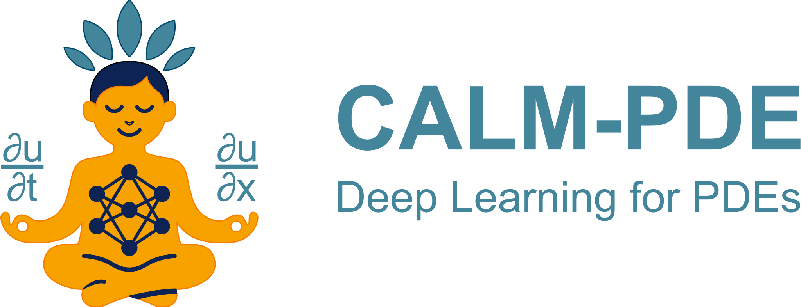

<p align="center"></p>

<p align="center">
  <p align="center">
   <h1 align="center">CALM-PDE: Continuous and Adaptive Convolutions for Latent Space Modeling of Time-dependent PDEs</h1> 
  </p>
  <p align="center" style="font-size:16px">
    <a target="_blank" href="https://jhagnberger.github.io"><strong>Jan Hagnberger</strong></a>,
    <a target="_blank" href="https://www.ki.uni-stuttgart.de/institute/team/Musekamp-00001"><strong>Daniel Musekamp</strong></a>,
    <a target="_blank" href="https://matlog.net"><strong>Mathias Niepert</strong></a>
  </p>
</p>


This repository contains the official PyTorch implementation of the CALM-PDE model from the paper,
"[**CALM-PDE: Continuous and Adaptive Convolutions for Latent Space Modeling of Time-dependent PDEs**](https://arxiv.org/abs/2505.12944)".

## 🛠️ Requirements

The CALM-PDE model requires and is tested with the following packages.
- [PyTorch](https://pytorch.org) in version 2.5.1
- [NumPy](https://numpy.org) in version 2.1.3
- [Optimized Einsum](https://dgasmith.github.io/opt_einsum) in version 3.4.0
- [Einops](https://einops.rocks) in version 0.8.0


Please also see the [``environment.yml``](./environment.yml) file, which contains all packages to run the provided examples.


## 🚀 Usage of CALM Layers

The file [``calm_pde/layer_examples.py``](./calm_pde/layer_examples.py) contains several examples demonstrating the use of CALM layers. The example below shows how a CALM layer can be used to encode a 2D point cloud with 4096 points into a latent point cloud with 512 points and 16 channels.

```python
import torch
from models.layers import CALMEncoderLayer
device = torch.device('cuda' if torch.cuda.is_available() else 'cpu')

encoder = CALMEncoderLayer(in_channels=2,
                           out_channels=16,
                           num_query_points=512,
                           receptive_field=0.1,
                           softmax_temp=1.0,
                           spatial_dim=2,
                           is_periodic=False,
                           init_query_pos=None,
                           dropout=0.0).to(device)

# Create random point cloud in 2D with the same coordinates for each sample
features = torch.rand(4, 4096, 2, device=device) # (b, n, c)
mesh = torch.rand(4096, 2, device=device) # (n, d)
features_new, positions = encoder(features, mesh) # (4, 512, 16), (512, 2)
```

## 🤖 Usage of CALM-PDE Models
The file [``calm_pde/model_examples.py``](./calm_pde/model_examples.py) contains several examples demonstrating the use of CALM-PDE models. The example below shows how the CALM-PDE model can be used for a 2D PDE such as Navier-Stokes sampled on a regular mesh.

```python
import torch
from models.dynamics_models import NeuralODE
from models.models_2d import CALM_PDE_Vorticity
device = torch.device('cuda' if torch.cuda.is_available() else 'cpu')


# Using the CALM-PDE model for a 2D PDE such as Navier-Stokes. We assume that
# each sample has the same mesh and that the mesh is periodic.
processor = NeuralODE(128, 256, n_heads=8, is_periodic=True)
model = CALM_PDE_Vorticity(processor, in_channels=1, out_channels=1, dropout=0.0).to(device)

# Create random 2D data
u_0 = torch.rand(4, 4096, 1, device=device) # (b, n, c)
input_mesh = torch.rand(4096, 2, device=device) # (n, d)
output_mesh = torch.rand(4096, 2, device=device) # (n, d)
rollout_steps = 20
u = model.forward(u_0, input_mesh, output_mesh, rollout_steps) # (4, 20, 4096, 1)
```

## 💾 Datasets
We use the following datasets in our experiments.

- [PDEBench 1D Burgers' equation with &nu;=1e-4](https://darus.uni-stuttgart.de/file.xhtml?fileId=268190&version=8.0)
- [FNO 2D vorticity datasets with &nu;=1e-4 and &nu;=1e-5](https://drive.google.com/drive/folders/1UnbQh2WWc6knEHbLn-ZaXrKUZhp7pjt-)
- [PDEBench 3D incompressible Navier-Stokes equations with &eta;=&zeta;=1e-8](https://darus.uni-stuttgart.de/file.xhtml?fileId=173286&version=8.0)
- [MeshGraphNet 2D airfoil dataset](https://github.com/google-deepmind/deepmind-research/tree/master/meshgraphnets) 
- [MeshGraphNet 2D cylinder dataset](https://github.com/google-deepmind/deepmind-research/tree/master/meshgraphnets)

You can either download the datasets directly from the resources linked above or use the provided scripts in [``📂 datasets``](./datasets) to download the data files.


## 🔬 Experiments
To reproduce the results reported in the paper, please follow the instructions below.


### 1. PDEBench 1D Burgers' Equation
1. Download the [dataset](https://darus.uni-stuttgart.de/file.xhtml?fileId=268190&version=8.0) with ``sh datasets/download_pdebench_datasets.sh 1d_burgers {LOCAL_DIR}``
2. Set ``data_path: "{LOCAL_DIR}/pdebench_datasets/"`` in the configuration file [``calm_pde/config/1d_pdebench_burgers.sh``](./calm_pde/config/1d_pdebench_burgers.yaml)
3. Move to the directory [``📂 bash``](./bash) and run the experiment with ``sh pdebench_burgers.sh`` or submit it to SLURM with ``sbatch pdebench_burgers.sh``


### 2. FNO 2D Vorticity Datasets
1. Download the preprocessed [datasets](https://drive.google.com/drive/folders/1UnbQh2WWc6knEHbLn-ZaXrKUZhp7pjt-) with ``sh datasets/download_fno_datasets.sh 1e-4 {LOCAL_DIR}``
2. Set ``data_path: "{LOCAL_DIR}/fno_vorticity_datasets/"`` in the file [``calm_pde/config/2d_fno_1e-4.yaml``](./calm_pde/config/2d_fno_1e-4.yaml)
3. Move to the directory [``📂 bash``](./bash) and run the experiment with ``sh fno_votiticy_1e-4.sh`` or submit it to SLURM with ``sbatch fno_votiticy_1e-4.sh``


### 3. PDEBench 3D Compressible Navier-Stokes Equation
1. Download the [dataset](https://darus.uni-stuttgart.de/file.xhtml?fileId=173286&version=8.0) with ``sh datasets/download_pdebench_datasets.sh 3d_navier_stokes {LOCAL_DIR}``
2. Set ``data_path: "{LOCAL_DIR}/pdebench_datasets/"`` in the file [``calm_pde/config/3d_pdebench_cns.yaml``](``calm_pde/config/3d_pdebench_cns.yaml``)
3. Move to the directory [``📂 bash``](./bash) and run the experiment with ``sh pdebench_3d_cns.sh`` or submit it to SLURM with ``sbatch pdebench_3d_cns.sh``


### 4. MeshGraphNets 2D Airfoil Dataset
1. Download the preprocessed [dataset](https://github.com/google-deepmind/deepmind-research/tree/master/meshgraphnets) with ``sh datasets/download_preprocessed_meshgraphnets_datasets.sh airfoil {LOCAL_DIR}``
2. Set ``data_path: "{LOCAL_DIR}/meshgraphnets_datasets/airfoil/"`` in the file [``calm_pde/config/2d_airfoil_time.yaml``](./calm_pde/config/2d_airfoil_time.yaml)
3. Move to the directory [``📂 bash``](./bash) and run the experiment with ``sh airfoil.sh`` or submit it to SLURM with ``sbatch airfoil.sh``


### 5. MeshGraphNets 2D Cylinder Dataset
1. Download the preprocessed [dataset](https://github.com/google-deepmind/deepmind-research/tree/master/meshgraphnets) with ``sh datasets/download_preprocessed_meshgraphnets_datasets.sh cylinder_flow {LOCAL_DIR}``
2. Set ``data_path: "{LOCAL_DIR}/meshgraphnets_datasets/cylinder_flow/"`` in the file [``calm_pde/config/2d_cylinder_time.yaml``](./calm_pde/config/2d_cylinder_time.yaml)
3. Move to the directory [``📂 bash``](./bash) and run the experiment with ``sh cylinder.sh`` or submit it to SLURM with ``sbatch cylinder.sh``


## 🏗️ CALM-PDE Architecture
The following illustration shows the architecture of the CALM-PDE model for solving 2D time-dependent PDEs (e.g., incompressible Navier-Stokes equations with a cylinder geometry). CALM-PDE consists of three key components:

- Encoder: Encodes the arbitrarily discretized PDE solution into a fixed latent space
- Processor: Computes the latent representation of future timesteps via latent time-stepping
- Decoder: Decodes the latent representation back to the spatial domain for queried coordinates


## 🧳 Directory Tour
Below is a listing of the directory structure of the CALM-PDE repository.

[``📂 calm_pde``](./calm_pde): Contains the code for the CALM-PDE model and the experiments. \
[``📂 bash``](./bash): Contains bash scripts to run the experiments. \
[``📂 datasets``](./datasets): Contains bash scripts to download the used datasets.


## 🌟 Acknowledgements
We would like to thank the authors of PDEBench, FNO, and MeshGraphNets for their datasets, which we have used in our experiments. Furthermore, we would like to thank the authors of PDEBench for their benchmark framework, which served as inspiration for our codebase. 


## ⚖️ License

MIT licensed, except where otherwise stated. Please see [`LICENSE`](./LICENSE) file.

## ✏️ Citation
If you find our project useful, please consider citing it.

```
@misc{calm-pde-hagnberger:2025,
      title={{CALM-PDE}: Continuous and {A}daptive {C}onvolutions for {L}atent {S}pace {M}odeling of {T}ime-dependent {PDE}s}, 
      author={Jan Hagnberger and Daniel Musekamp and Mathias Niepert},
      year={2025},
      eprint={2505.12944},
      archivePrefix={arXiv},
      primaryClass={cs.LG},
      url={https://arxiv.org/abs/2505.12944}, 
}
```